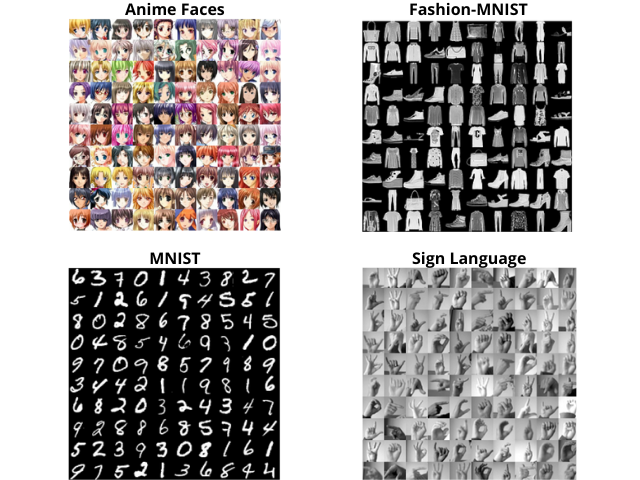
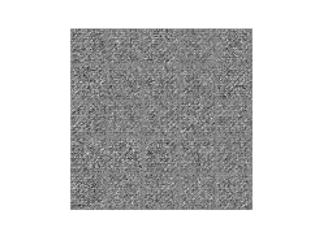
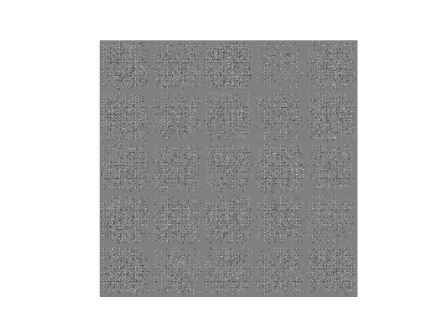

# <h1 align="center">**DCGAN**</h1>

 

This repository is dedicated to the implementation of [Deep Convolutional Generative Adversarial Networks (DCGAN)](https://arxiv.org/pdf/1511.06434.pdf), a specialized variant of GANs that replaces dense layers with convolutional and transposed layers. By employing convolutional layers in both the discriminator and the generator, DCGANs can effectively capture the spatial features inherent in images, leading to the generation of higher quality images. Furthermore, the use of convolutional layers allows DCGANs to handle high-resolution images more efficiently. Compared to standard GANs, DCGANs tend to be more stable during training, thereby facilitating model convergence.

## **Components of a GAN**

- **Generator:** Its role is to create "fake" images that resemble real images used in training. During the training process, the generator continually strives to deceive the discriminator, consistently improving the quality of the forgeries it produces. Balance is achieved when the generator is able to generate perfect forgeries that are indistinguishable from the real images used in the training dataset.

- **Discriminator:** Its task is to determine whether a given image is real or a forgery generated by the generator. During training, the discriminator is trained to be a more effective "detective," learning to properly classify images as real or fake. Balance is achieved when the discriminator cannot distinguish between real images and those generated by the generator, and therefore, always has a 50% probability of determining whether a given image is real or fake.

## **Used Datasets**

- **Fashion-MNIST**: This dataset consists of 70,000 grayscale images representing clothing items, distributed across 10 different categories.

- **MNIST**: This dataset consists of 70,000 grayscale images of handwritten digits ranging from 0 to 9.

- **Sign language**: This dataset includes 27,455 grayscale images representing human hands making gestures of sign language.

## **Implementations in TensorFlow and PyTorch**
Implementations have been done in both TensorFlow and PyTorch, the two most widely used frameworks in Deep Learning, to explore the capabilities of DCGANs. Each implementation provides insights into the differences and similarities between these frameworks, offering practical perspectives for professionals in the field.

The notebooks are located in the [models folder](models).

## **Generated Examples**

    

        
        
        
    

*You can observe how generation improves as epochs progress.*

## **Technological Stack**
 

## **Contact**

